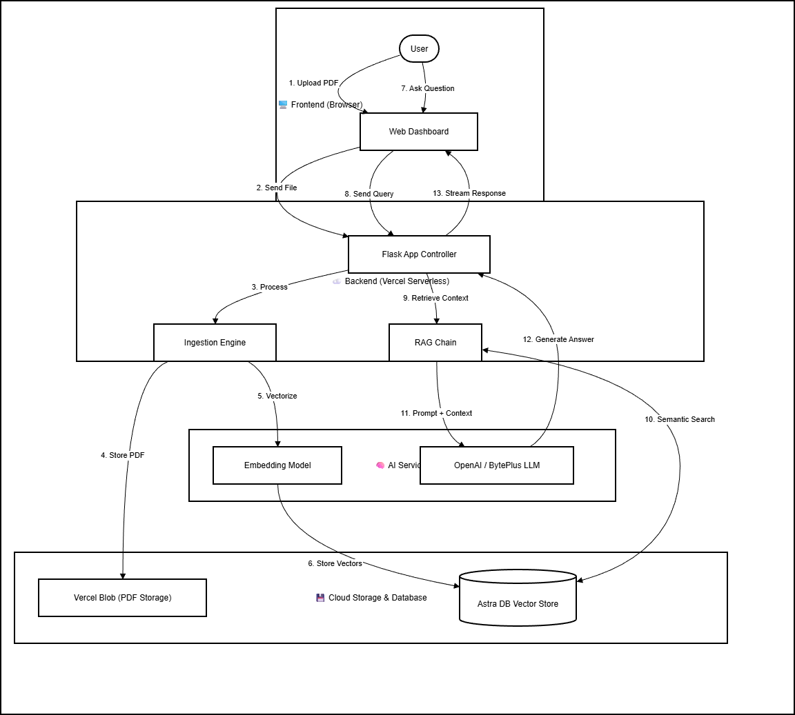

# 🎓 ScholarSync - Intelligent Research Assistant


**ScholarSync** is an advanced AI-powered "Thesis Consultant" (Dosen Pembimbing AI) specifically engineered to assist final-year students (*pejuang skripsi*) in analyzing, synthesizing, and extracting precise insights from academic documents.

Built on a robust **Serverless-First** architecture, ScholarSync leverages the synergy of **Large Language Models (OpenAI)**, **Vector Search (Astra DB)**, and **Cloud Storage (Vercel Blob)** to deliver hallucination-free, citation-backed answers strictly grounded in your provided reference materials.

---

## 🏗️ System Architecture

The following flowchart illustrates the data flow and system components of ScholarSync, from document ingestion to AI response generation.



---

## 🚀 Key Features

### 🧠 Intelligent Document Analysis
*   **Context-Strict RAG**: Utilizes Retrieval-Augmented Generation to answer questions *only* based on your uploaded documents, preventing AI hallucinations.
*   **Project Isolation**: Maintains strict boundaries between different research projects (e.g., "Skripsi V1" vs "Jurnal Alpha").
*   **Precision Citations**: Every claim is backed by actionable citations (e.g., `[[referensi.pdf|page 5]]`) that link directly to the source evidence.

### 📄 Advanced Document Management
*   **Integrated PDF Viewer**: Split-screen interface allows instant verification of citations without context switching.
*   **Cloud Persistence**: Documents are securely stored in **Vercel Blob**, ensuring availability across serverless instance recycles.
*   **Semantic Search**: Finds relevant sections not just by keywords, but by meaning and context.

### 🎨 Premium User Experience
*   **Modern Interface**: Clean, glassmorphism-inspired UI built with **TailwindCSS** for a focus-friendly environment.
*   **Progress Tracking**: Interactive dashboard to monitor research milestones and document processing status.
*   **Markdown Export**: One-click export of chat sessions to formatted Markdown for seamless integration into your thesis draft.

---

## 🛠️ Technology Stack

| Domain | Technology | Purpose |
| :--- | :--- | :--- |
| **Backend** | **Flask (Python)** | Core application logic and API handling. |
| **Frontend** | **Jinja2 + TailwindCSS** | Server-side rendering with utility-first styling. |
| **AI Engine** | **LangChain + OpenAI** | Orchestration, reasoning, and response generation. |
| **Vector DB** | **DataStax Astra DB** | High-performance serverless vector storage for embeddings. |
| **Storage** | **Vercel Blob** | Scalable object storage for PDF documents. |
| **Deployment** | **Vercel** | Serverless hosting platform ensuring high availability. |

---

## ⚙️ Installation & Local Setup

Follow these steps to run ScholarSync locally on your machine.

### Prerequisites
*   Python 3.9 or higher
*   Git

### 1. Clone the Repository
```bash
git clone https://github.com/Farmil23/ScholarSync.git
cd ScholarSync
```

### 2. Install Dependencies
It is recommended to use a virtual environment.
```bash
python -m venv venv
source venv/bin/activate  # On Windows: venv\Scripts\activate
pip install -r requirements.txt
```

### 3. Configure Environment Variables
Create a `.env` file in the project root and add your API keys:

```env
# OpenAI Configuration
OPENAI_API_KEY=sk-your-openai-key

# Astra DB Configuration
ASTRA_DB_API_ENDPOINT=https://<your-db-id>-<region>.apps.astra.datastax.com
ASTRA_DB_APPLICATION_TOKEN=AstraCS:your-token...

# Vercel Blob Configuration
BLOB_READ_WRITE_TOKEN=vercel_blob_...

# Application Security
SECRET_KEY=your_secure_random_key
```

### 4. Run the Application
```bash
python app.py
```
Access the application at `http://localhost:5000`.

---

## ☁️ Deployment Guide (Vercel)

ScholarSync is optimized for the Vercel ecosystem.

1.  **Push to GitHub**: Ensure your code is in a GitHub repository.
2.  **Import to Vercel**: Connect your repository in the Vercel Dashboard.
3.  **Environment Variables**: Add all variables from your `.env` file to the Vercel Project Settings.
4.  **Blob Storage**: Create a Vercel Blob store and link it to your project to generate the `BLOB_READ_WRITE_TOKEN`.
5.  **Deploy**: Click deploy and watch your AI assistant go live! 🚀

---

## 🛡️ License

This project is protected under the MIT License. See the [LICENSE](LICENSE) file for more details.

**Copyright © 2025 Farhan Kamil. All Rights Reserved.**

---

<p align="center">
  Built with ❤️ for Pejuang Skripsi everywhere.
</p>
